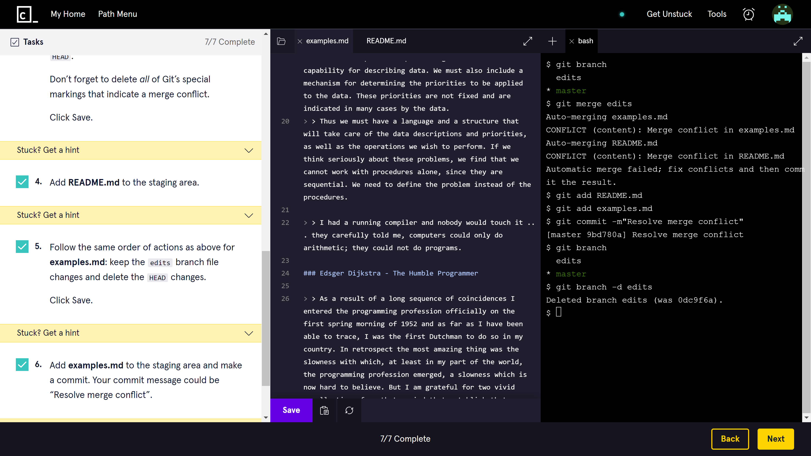

# Ruby Time Calculator

## General info

 This is a challenge project set as part of the Codecademy Back-End Engineer career path course.

## Technologies

* Git

## Status

Project is: _COMPLETE_

## Inspiration

Project created as part of Codecademy Full-Stack Engineer career pathway.

